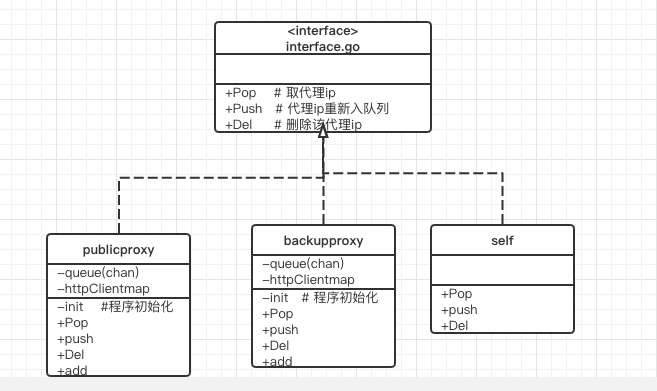
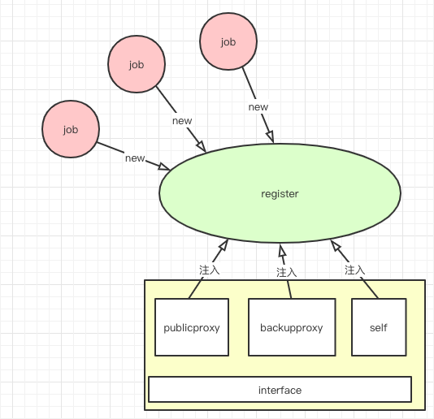

关于如何实现 代理ip的稳定
===
#### 一、如何使用proxypools
```
// 1、使用代理池管理注册中心 先注入你的代理池(免费代理池,备用代理池,自身)
r := NewRegister()
r.Add(proxy,retrymax,name)
// proxy: 实现了 Proxy 接口的代理池
// retrymax: 每个代理池 每个job 可尝试获取的次数
// name : 该代理池的名称


// 2、 使用 代理池管理中心
p:=Newproxypools()
p.Pop()(HTTPClientMap,int,bool)
// HTTPClientMap 含有ip 和这个代理ip 的http.client
// int  : 哪一个代理池
// bool: 是否获取到了 代理ip
p.Push(index, HTTPClientMap)  // 当job 获取到数据时 将使用的代理再放回对应的代理池中
p.Del(index,HTTPClientMap)    // 代理不可用时 删除该代理


// 3、如何扩充自己的代理池
只要实现了interface.go 里面的Proxy 接口就可以了
```

#### 二、目录
```
proxypool
    |- interface.go
    |- register.go
    |- metrics.go   // prometheus  监控
    |- proxypools.go
    |- publicproxy
      |- publicproxy.go
    |- backupproxy
      |- backupproxy.go
    |-self
      |- self.go

```

#### 三、接口实现


#### 四、接口实现程序
* interface.go

```
type IpHTTPClient struct{
	ip string
	*http.Client
}

type Proxy interface {
	Pop()(IpHTTPClient,bool)   // 取数据
	Push(IpHTTPClient)        // 推送数据
	Del(ip string)            // 删除数据
	Len()int                  // 代理池的数量
}
```
* publicproxy.go

```
type publicproxy strut {
    queue chan IpHTTPClient   // 从redis中取的ip
    httpclientmap map[string]*http.Client
}

func (p *publicproxy)init(){
    // 从redis 中取代理IP
    // 接收指令 获取代理IP
}

func(p *publicproxy) Pop()(IpHTTPClient,bool){
    // 用池中取ip
}

func (p *publicproxy) Push(IpHTTPClient){
    // 使用过后再重写放入池中
}

func (p *publicproxy) Del(ip string){
    // 不可使用的ip 删除
}

func Len()int{
}


func NewPublicPorxy(queuechannum int)publicproxy{
    // 实例话 并 执行init 方法    
}
```

* backupproxy.go

```
type backupproxy strut {
    queue chan IpHTTPClient   // 从redis中取的ip
    httpclientmap map[string]*http.Client
    
}

func (b *backupproxy)init(){
    // 从文件 中取 备用IP
    // 时刻检测文件是否变更过，变更过则重新取备用ip
}

func(b *backupproxy) Pop()(IpHTTPClient,bool){
    // 从备用池中取ip
}

func (b *backupproxy) Push(IpHTTPClient){
    // 使用过后再重写放入池中
}

func (b *backupproxy) Del(ip string){
    // 不可使用的ip 删除
}
func (b *backupproxy) Len()int{
}


func Newbackupproxy()publicproxy{
    // 实例话 并 执行init 方法    
}
```

* self.go

```
type self strut {
    warnUrl string  // 警告 地址
}


func(s *self) Pop()(IpHTTPClient,bool){
    go func(){ // 警告通知 }()
    return ...
}

func (s *self) Push(IpHTTPClient){
    return
}

func (s *self) Del(ip string){
    return
}
func (s *self) Len()int{
}

fun NewSelf(url string){
    
}

```

#### 五、逻辑的实现


#### 六、逻辑实现讲解
* 6.1 逻辑讲解

```
程序启动时，通过register的Add 方式 先将 publicproxy ,beckupproxy,self 注入至 register 中，

每一个job 会从proxypools new 一下获得一个实例，使用时通过Pop方法 去取代理ip。直至次数用完（或者爬到数据结束）
```

* 6.2 逻辑代码
* `register.go`

```
// 代理池管理注册中心

type proxypoolRetrynum struct {
    proxy    Proxy
    retrynum int
}

var proxypoolRetrynums []proxypoolRetrynum

func init() {
    proxypoolRetrynums = make([]proxypoolRetrynum, 0)
}


type Register struct{
    Metrics *metrics
}

// 注入 不同proxy池，和每个池允许job调用的次数
func (r *Register)Add(proxy Proxy, retrynum int, proxyName string) {
    r.cronCheckProxyNum(proxyName,proxy)
    proxypoolRetrynums = append(proxypoolRetrynums, proxypoolRetrynum{proxy, retrynum})
}

func (r *Register) cronCheckProxyNum(name string,proxy Proxy){
    go func() {
        tc := time.NewTicker(time.Second)
        for {
            select {
            case <-tc.C:
                r.Metrics.proxypoolnumset(name,float64(proxy.Len()))
            }
        }
    }()
}

func NewRegister()*Register{
    r := new(Register)
    r.Metrics = NewMetrics("proxypool")
    return r
}
```

* `proxypool.go`

```
// 代理池管理中心

type proxypools struct {
    proxypools []proxypoolRetrynum
}

func (r *proxypools) Pop() (clientMap HTTPClientMap, index int,ok bool) {
    var v proxypoolRetrynum
    for index, v = range r.proxypools {
        switch {
        // -1 随便取
        case v.retrynum == -1:
            clientMap, ok = v.proxy.Pop()

            if ok {
                // 存在返回
                return
            } else {
                // 不存在跳过
                continue
            }
        // >0 有次数限制
        case v.retrynum > 0:
            clientMap, ok = v.proxy.Pop()
            if ok {
                // 存在返回  次数减1
                //v.retrynum--
                r.proxypools[index].retrynum--
                return
            } else {
                // 不存在 跳过
                continue
            }
        // 0 这个代理池不能取了
        default:
            continue
        }
    }

    return
}

func (r *proxypools) Push(index int, clientMap HTTPClientMap) {
    proxypoolRetrynums[index].proxy.Push(clientMap)
}

func (r *proxypools) Del(index int, clientMap HTTPClientMap) {
    proxypoolRetrynums[index].proxy.Del(clientMap.Ip)
}

func Newproxypools() *proxypools {
    r := new(proxypools)
    r.proxypools = make([]proxypoolRetrynum,len(proxypoolRetrynums))
    copy(r.proxypools, proxypoolRetrynums)
    return r
}

```


#### 七、图解

```sequence
job(task)->proxypool: Pop() 取ip
proxypool->job(task):Pop() 返回ip
job(task)->proxypool: Push() ip入队列
job(task)->proxypool: Del() 删除指定的ip

publicproxy(公用ip池)->proxypool:注册至该程序中
backupproxy(备用ip池)->proxypool:注册至该程序中
self(自身)->proxypool:注册至该程序中
```
